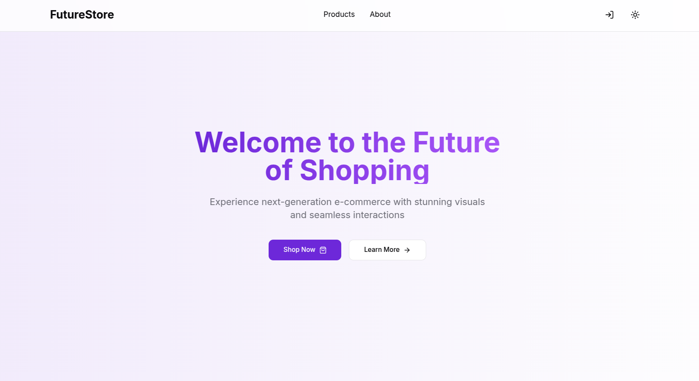
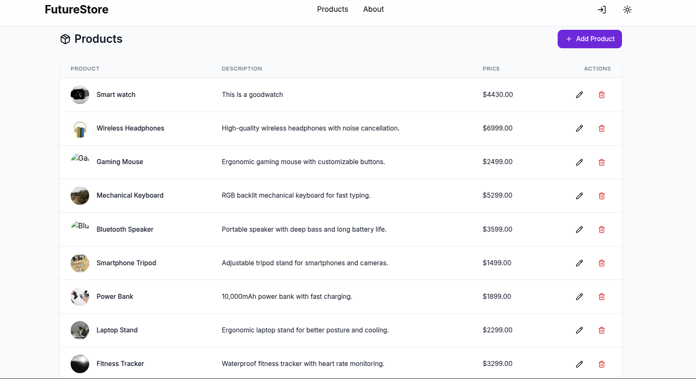

📜 Project README (README.md in root directory)
markdown
Copy
Edit
# 🚀 Project Bolt

Project Bolt is a full-stack web application built with **Node.js (Express.js)** for the backend and **React (Next.js/Vite/etc.)** for the frontend.  

---

## 📂 Project Structure
project-bolt/ │-- backend/ # Backend (Node.js + Express) │-- frontend/ # Frontend (React/Next.js/Vite) │-- README.md # Project documentation

yaml
Copy
Edit

---

## 🛠 Tech Stack
### 🔹 Frontend:
- React (Next.js/Vite)
- Tailwind CSS / Styled Components
- React Query for data fetching
- Framer Motion for animations

### 🔹 Backend:
- Node.js + Express.js
- MongoDB (Mongoose) / PostgreSQL
- JWT Authentication
- Bcrypt for password hashing

### 🔹 DevOps & Tools:
- Docker (Optional)
- AWS / Vercel for deployment
- Git & GitHub for version control

---

## 🚀 Getting Started

### 1️⃣ Clone the Repository
```bash
git clone https://github.com/yourusername/project-bolt.git
cd project-bolt
2️⃣ Install Dependencies
For Backend:
bash
Copy
Edit
cd backend
npm install
For Frontend:
bash
Copy
Edit
cd ../frontend
npm install
3️⃣ Configure Environment Variables
Create a .env file in both backend/ and frontend/ with required keys.

Backend (backend/.env):
env
Copy
Edit
PORT=5000
MONGO_URI=mongodb://localhost:27017/your_db
JWT_SECRET=your_secret_key
Frontend (frontend/.env):
env
Copy
Edit
VITE_API_URL=http://localhost:5000
NEXT_PUBLIC_API_URL=http://localhost:5000
▶️ Running the Project
🔹 Start Backend
bash
Copy
Edit
cd backend
npm start  # or npm run dev for hot-reloading
🔹 Start Frontend
bash
Copy
Edit
cd frontend
npm run dev
🔗 API Endpoints
Method	Endpoint	Description
GET	/api/products	Fetch all products
POST	/api/products	Create a new product
PUT	/api/products/:id	Update product details
DELETE	/api/products/:id	Delete a product
📦 Deployment
Backend: Hosted on AWS / Render / Digital Ocean
Frontend: Deployed on Vercel / Netlify


ScreenShot




[text](../../../..)

